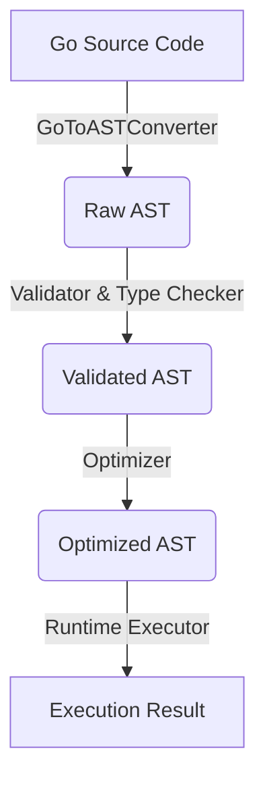

# Go-Mini Architecture (Isolated Raw-FFI Edition)

Go-Mini is a high-performance, strictly isolated Go-like script execution engine. Its design fundamentally cuts off direct memory sharing between the Host (Go environment) and the VM (execution engine), prioritizing security, determinism, and I/O efficiency.

## 1. Core Principles

*   **Absolute Memory Isolation**: The VM and Host do not share any Go pointers. The VM manages its own variables, and all cross-boundary interactions occur via binary message passing.
*   **Zero-Reflection (`reflect`-free)**: The execution path (Parser, Validator, Optimizer, and Runtime) strictly avoids Go's `reflect` package to guarantee predictable performance and avoid dynamic allocation overhead.
*   **Data Reduction (Primitives)**: Complex Go scalar types (`int`, `int32`, `uint8`, `float32`, etc.) are internally reduced and mapped to core primitives: `Int64`, `Float64`, `Bool`, and `String`.
*   **Raw-FFI IPC**: Host-VM communication is achieved through high-performance binary buffers (`ffigo.Buffer`).
*   **Static Code Generation**: FFI boundaries (Host Routers and VM Proxies) are generated at compile-time via the `ffigen` tool, avoiding runtime dynamic dispatch.

## 2. Execution Pipeline

The lifecycle of a Go-Mini script involves several distinct phases:

1.  **Converter (`core/ffigo/converter.go`)**: Translates standard Go source code into Go-Mini's internal Abstract Syntax Tree (AST). It adapts syntaxes like `:=` to explicit declarations and standardizes function calls.
2.  **Validator (`core/ast/ast_valid.go`)**: Performs rigorous semantic and type checking. It registers structs and functions, and validates type constraints (e.g., ensuring `if` conditions are `Bool`).
3.  **Optimizer (`core/ast`)**: Unrolls syntactic sugar. For example, `i++` becomes `i = i + 1`, and `switch` statements are lowered into `if-else` chains. It also finalizes type reduction.
4.  **Executor (`core/runtime/executor.go`)**: Interprets the optimized AST. It maintains localized scopes (`runtime.Scope`) and manages execution state.

## 3. The FFI Bridge (Message Passing)

Since memory is strictly isolated, all calls to standard libraries or host-provided functions go through the FFI Bridge.

*   **Calling Mechanism**: When the VM encounters an external function call, it serializes the arguments into a `ffigo.Buffer` (a contiguous `[]byte`).
*   **Routing**: The buffer, along with a `MethodID`, is passed to the Host. The Host router (generated by `ffigen`) reads the raw bytes, reconstructs the Go values, and invokes the actual native Go function.
*   **Return**: The native function's results are packed back into a buffer and handed to the VM, where they are deserialized into VM primitives.

## 4. Resource Management (Handle System)

Host resources that cannot (or should not) be serialized across the FFI boundary (e.g., file descriptors like `*os.File`, network sockets `net.Conn`, or database connections) are managed via a **Handle System**.

1.  **Host Registry**: The Host maintains a secure registry mapping integer IDs to actual Go object instances (`map[uint32]interface{}`).
2.  **VM Handle**: The VM is given a lightweight, opaque Handle (a `uint32` ID), rather than a pointer.
3.  **Operation**: When the VM wants to read from a file, it sends an FFI request containing the Handle ID and a read buffer. The Host retrieves the actual `*os.File` using the ID, performs the read, and returns the result to the VM.

## 5. Toolchain

*   **`cmd/ffigen`**: An essential command-line tool used by developers to parse standard Go interfaces and automatically emit the dense, boilerplate binary serialization/deserialization code required by both the Host and the VM.
